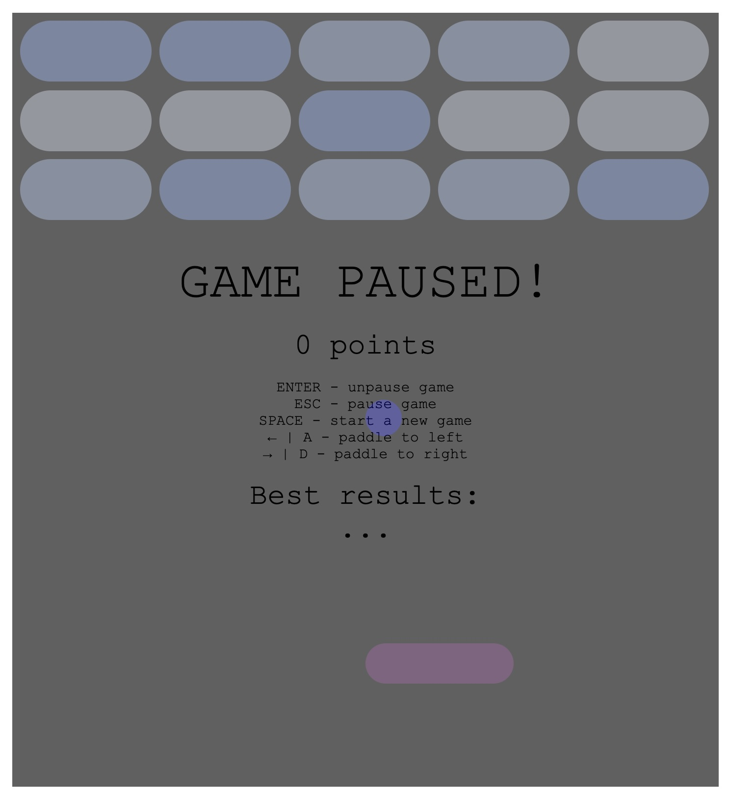
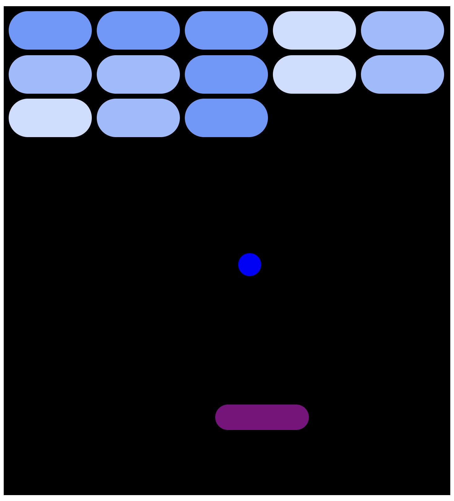
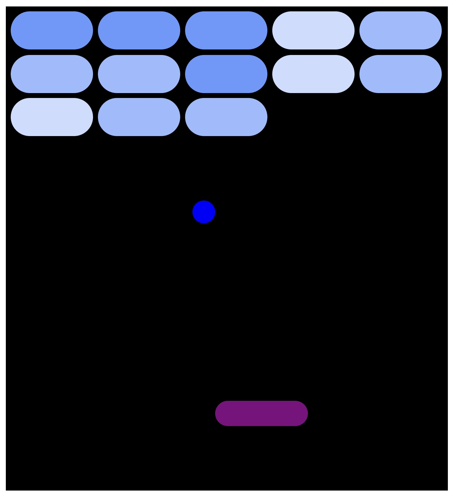
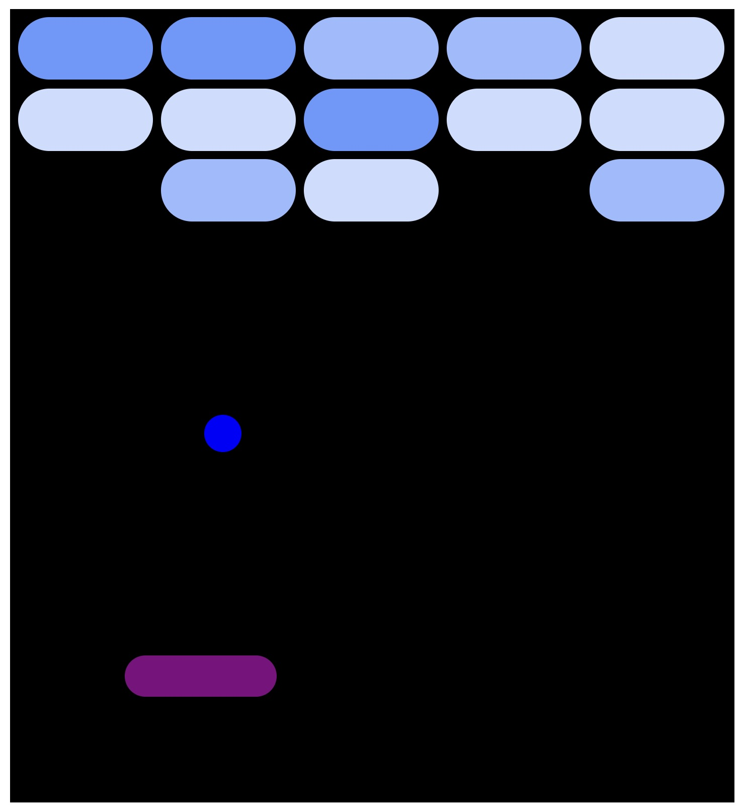
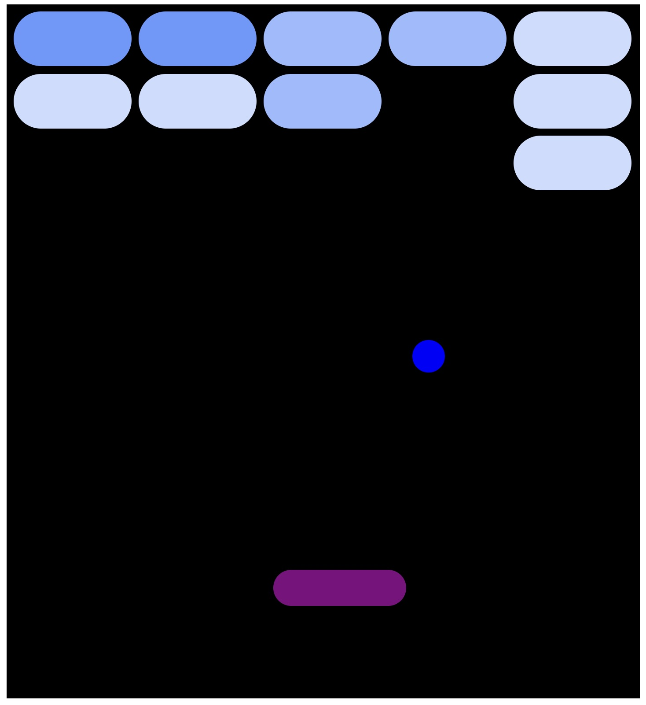
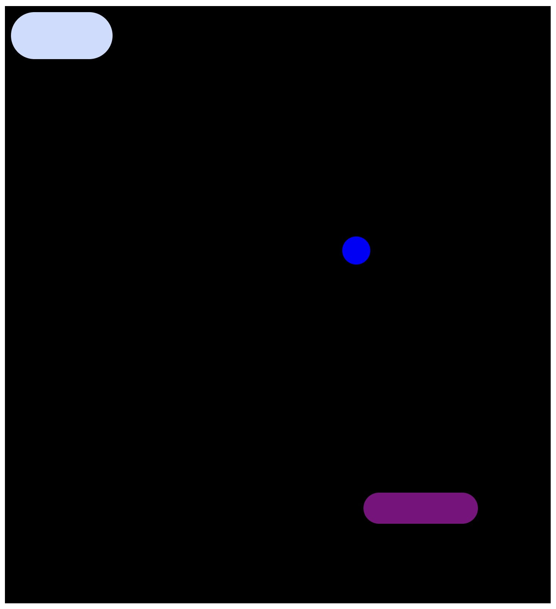
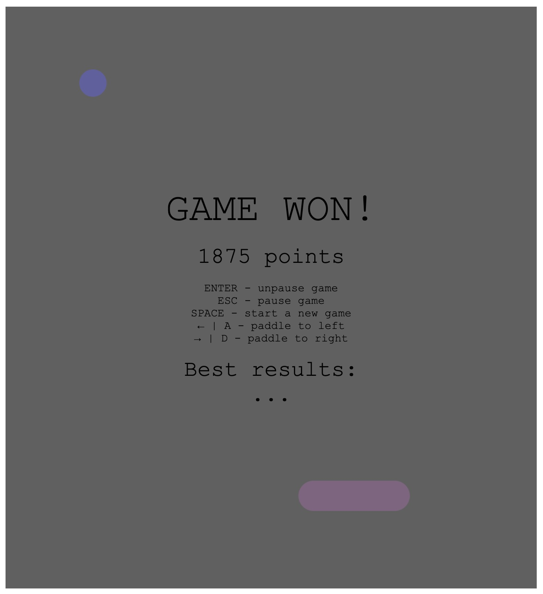
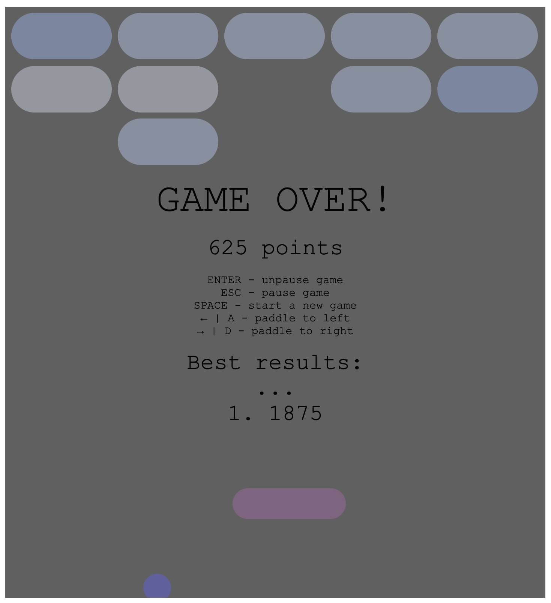
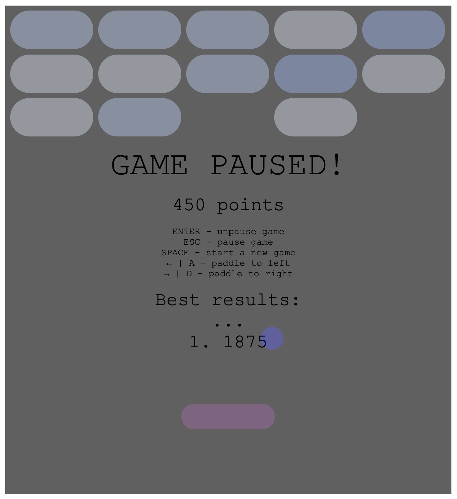

# Breakout-TS

A TypeScript implementation of the classic **Breakout (Atari Breakout)** arcade game.

The objective of the game is to destroy all tiles on the board by bouncing a ball off a paddle. The game includes randomized tile layouts, tiles with different durability levels, increasing ball speed, curved paddle physics and pause/win/lose states.

For the best user experience, play in a square or portrait-oriented browser window, such as those commonly found on mobile devices.

## Table of Contents


1. [Gameplay](#gameplay)
2. [Screenshots](#screenshots)
3. [Game Features](#game-features)
4. [Game Controls](#game-controls)
5. [Project Structure](#project-structure)
6. [Technologies](#technologies)
7. [Running the Project](#running-the-project)
8. [Setting up the Initial Project](#setting-up-the-initial-project)

---

## Gameplay

Breakout is a classic arcade game originally developed and published by **Atari, Inc.** in 1976.

The player controls a paddle located at the bottom of the screen. The goal is to keep the ball in play by bouncing it back towards the tiles at the top of the screen.

Tile require a different number of hits to be destroyed. Tile strengths are randomized for every game session. Stronger tiles require more hits and become visually lighter after each successful hit.

The game is lost if the ball falls below the paddle before all tiles are destroyed.

The game is won once every tile on the board has been removed.

---

## Screenshots

### Starting the Game



*Initial paused screen shown when opening the game.*

---

### Tile Strength Mechanics



*Tiles are generated with randomized strengths. Darker tiles require more hits to disappear.*



*After receiving a hit, the tile becomes lighter, showing that it has lost durability.*

---

### Gameplay Progress



*The player controls the paddle to keep the ball in play while destroying tiles.*



*As the game progresses, more tiles are destroyed and the remaining tiles become easier to track.*



*The final remaining tile before completing the game.*

---

### Game Results



*The win screen is displayed after all tiles have been destroyed, showing the final score.*



*The game over screen appears if the ball falls below the paddle before all tiles are destroyed.*

---

### Pause Functionality



*The game can be paused during gameplay and resumed later.*

---

## Game Features

### Randomized Tile Generation

Each game session generates a new tile layout. Tiles are randomized both in strength.

This creates a different gameplay experience every time the game is started.

---

### Tile Durability System

Tiles have different durability levels.

- Darker tiles require more hits.
- Each successful hit reduces the tile's durability.
- The tile becomes lighter after every hit.
- Tiles disappear once their durability reaches zero.

---

### Paddle Physics

The paddle does not behave as a completely flat surface.

Different areas of the paddle produce different bounce directions, creating a slightly curved paddle effect.

This allows the player to influence the ball trajectory depending on where the ball hits the paddle.

---

### Ball Physics

The ball can bounce from:

- The paddle
- Tiles
- The left and right walls
- The upper wall

The ball speed increases as the game progresses, making later stages more challenging.

---

### Winning and Losing Conditions

The game has two possible outcomes:

#### Victory

The player wins after destroying every tile on the board.

#### Game Over

The player loses if the ball falls below the paddle before all tiles are destroyed.

---

### Pause and Resume

The game supports pausing during gameplay.

Players can pause the game without losing their current progress and continue from the same state.

---

## Game Controls

The game is controlled using keyboard inputs.

### Paddle Movement

The paddle can be moved horizontally to control where the ball bounces.

- Move left:
    - Press the **Left Arrow (`←`)** key.
    - Alternatively, press **`A`**.

- Move right:
    - Press the **Right Arrow (`→`)** key.
    - Alternatively, press **`D`**.

The position where the ball hits the paddle affects its bounce direction. Hitting different areas of the paddle creates different ball trajectories.

---

### Game State Controls

- **Start / Resume Game**
    - Press **`Enter`** to start the game from the initial pause screen.
    - Press **`Enter`** to resume a paused game.

- **Pause Game**
    - Press **`Esc`** during gameplay to pause the game.

- **Restart Game**
    - Press **`Space`** to start a new game.

---

## Project Structure

```
Breakout-TS/
│
├── assets/
│   └── README screenshots
│
├── src/
│   └── TypeScript game implementation
│
├── public/
│
├── package.json
│
└── README.md
```

---

## Technologies

- TypeScript
- Vite
- HTML + CSS
- DOM Manipulation

---

## Running the Project

### Prerequisites

Before running the application, ensure you have installed:

- [Node.js](https://nodejs.org/)

---

### Installing Dependencies

1. Navigate to the project directory.
```bash
cd Breakout-TS
```

2. Install project dependencies.
```bash
npm install
```

---

### Starting the Development Server

Run the development server:
```bash
npm run dev
```

The terminal will display the local development URL:
```text
VITE v5.3.3  ready in 391 ms

➜  Local:   http://localhost:5173/
➜  Network: use --host to expose
➜  press h + enter to show help
```

Open the displayed URL in a browser to start playing the game.

---

## Setting Up the Initial Project
To create the TypeScript template and set up the project, use these commands:
~~~sh
npm create vite@latest Breakout-TS -- --template vanilla-ts
# Need to install the following packages:
# create-vite@5.3.0
# Ok to proceed? (y) y

# Scaffolding project in ...\\Breakout-TS...

# Done. Now run:

cd Breakout-TS
npm install
npm run dev
~~~